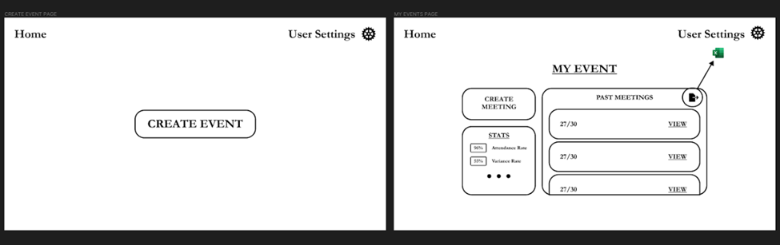
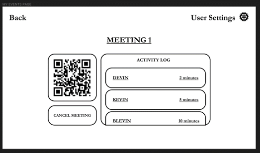
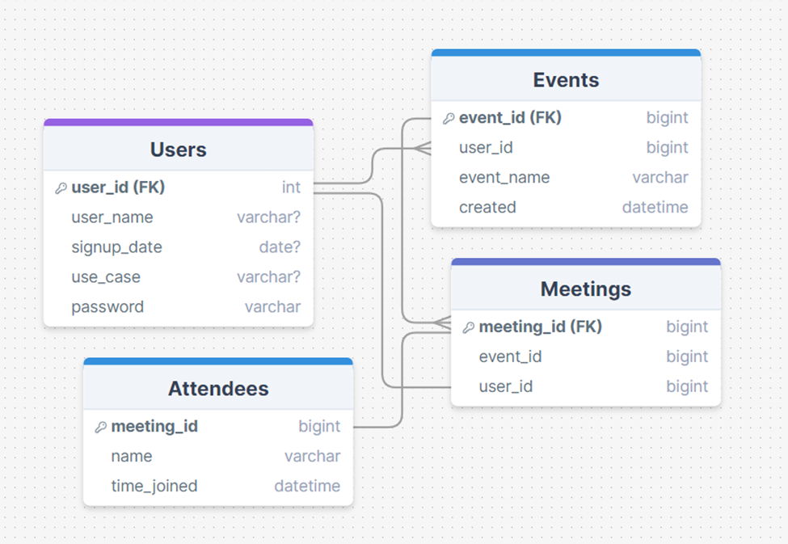
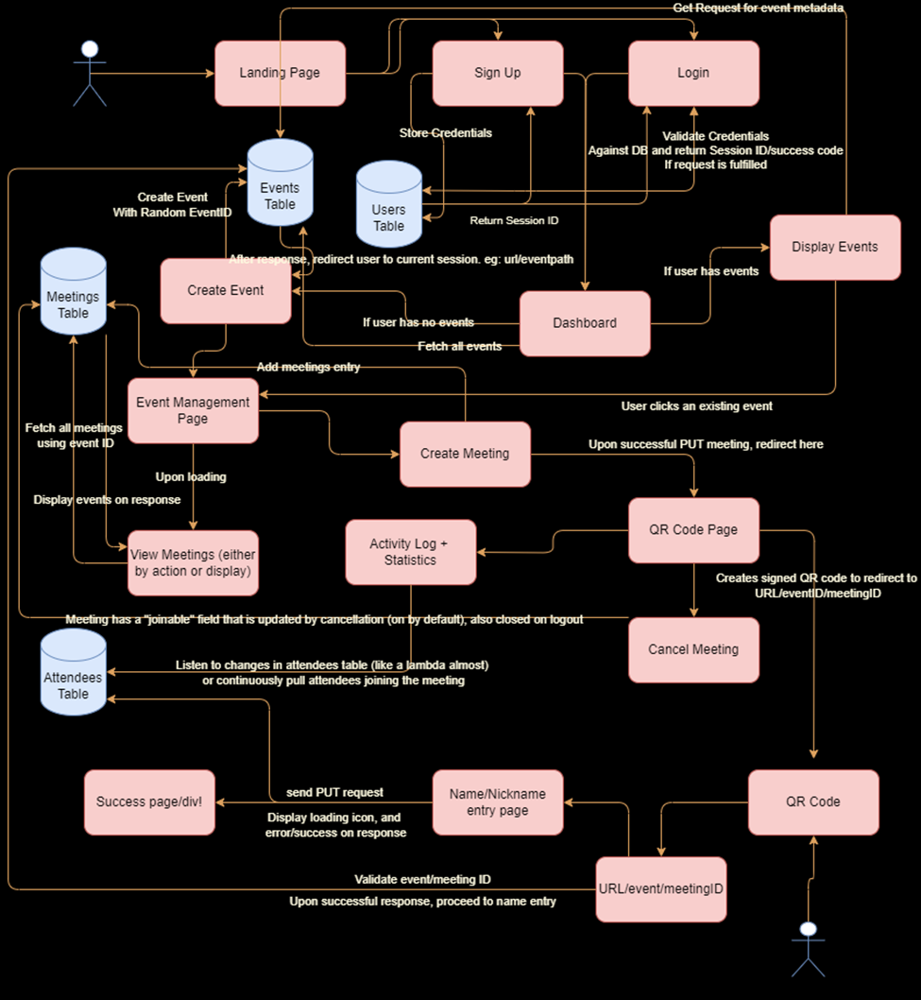

# Project Name: `(meetme.io)`

Group #7: 
By Simon Kurgan, Alex Labbe

# Project Description

## Who is our target audience?

We are building an easy-to-use attendance management system that allows users (whether that be teachers, students, or anyone alike) to easily create events and track attendance using generatable QR codes. Suppose you are a teaching assistant or perhaps an club coordinator interested in seeing your attendance over time. You can create an event and then designate individual meetings that record metrics and create a live attendance QR which other users can use to sign in. There is no limitation to who can benefit from the application provided they have a use for tracking attendance.

## Why does our audience want to use our application?

Although there are rudimentary solutions for the attendance problem, perhaps such as a piece of paper or verbal roll call, there are few that specifically allow people to make the process extensible, reusable, and that utilize the idea of QR code attendance. Complicated and larger systems for concerts and events have used the technology beforehand, but there is significant legwork in registering for and utilizing those services as an individual. Thus, our solution is meant to be accessible by web browser (either on phone or a desktop browser) by both event creators and event attendees. 

`Note`: because QR codes can be inaccessible to those who do not have devices with cameras, we intend to supply a simple URL that can be transcribed on the same page on which users scan a QR code.

## Why do we as developers want to build this application?

As developers, we want to build this app to explore 1) how to create an easy-to-use dashboard that reflects user actions and integrations 2) practice creating a foolproof system for attendance that reduces duplicate attendance or spoofing all the while learning a few new technologies and 3) learn how to export and manipulate that data to CSV or data visualization for the user using simple d3 or JS scripting.

# Design

# Technical Description

We intend to use a REST-based system for transmitting data. Below you will find our database schema, our use case diagram (complete with general DB interactions and user flow), and our user stories table.

## Database Diagram

We intend to use PostgreSQL or MySQL to store data in our MVP. Provided this will be our first time hosting such a db, we anticipate we may need to migrate to MongoDB. In that case, an updated schema for a NoSQL system will be updated within this document.

## User Flow + Data Flow Diagram

## User Stories Summary Table

| Priority | Role              | Task                    | Description                                                                                                     |
|----------|-------------------|-------------------------|-----------------------------------------------------------------------------------------------------------------|
| P0       | Event Coordinator | Create an event         | Base URL will be to create an event with an ID.                                                                 |
| P0       | Event Coordinator | Create an meeting         | Extended URL will be to create an meeting with an ID after the event ID path.                                                                 |
| P0       | Attendee          | Check into event        | Visit https://domain/eventID/meetingID, validate the event exists, and then enter name and add attendee entry. If a meeting is active, add record into database that user attended the event with a foreign key for the meeting and one for the event. If no event is active, display that. |
| P0       | Event Coordinator | Start a meeting         | url.com/userID/dashboard/eventID. Load information about the meeting at that id. Allow the coordinator to turn a meeting on. Use a websocket to update the list of attendees as users join. |
| P1       | Event Coordinator | Export attendee data    | Do some database table joins to create an array or another suitable datatype to represent attendee information. Map from this array to a CSV. Allow the coordinator to download the CSV. |
| P1       | Event Coordinator | Display a QR code       | Use QRCode.js with the active meeting link and display that QR code on the frontend at url.com/:id/dashboard.   |
| P1         | Event Coordinator | Cancel or Deactivate a meeting | Post an update to the database schema indicating that the meeting is no longer joinable| 
| P1 | Event Coordinator | View all past meetings for an event | Fetch all linked meetings for an event on the dashboard |
| P1 | Event Coordinator | View all past events for user | Fetch all linked events |

## Api Endpoints

`POST` /event/create - Create event

`POST` /event/:eventId/meeting/create - Create meeting under event

`POST` /event/:eventId/meeting/:meetingId/checkin - Add user entry to attendee table for linked meeting

`POST` /user/:userId/dashboard/event/:eventId/stop - Stop a meeting (Update db to be non-joinable for event)

`GET` /event/:eventId/dashboard/:meetingId/qr-code - Generate QR Code

`GET` /event/:eventId/past-meetings - Get all meetings for an appropriate event ID

`GET` /user/:userId/past-events - Get past events for a user (on dashboard load)

## MVP Images

